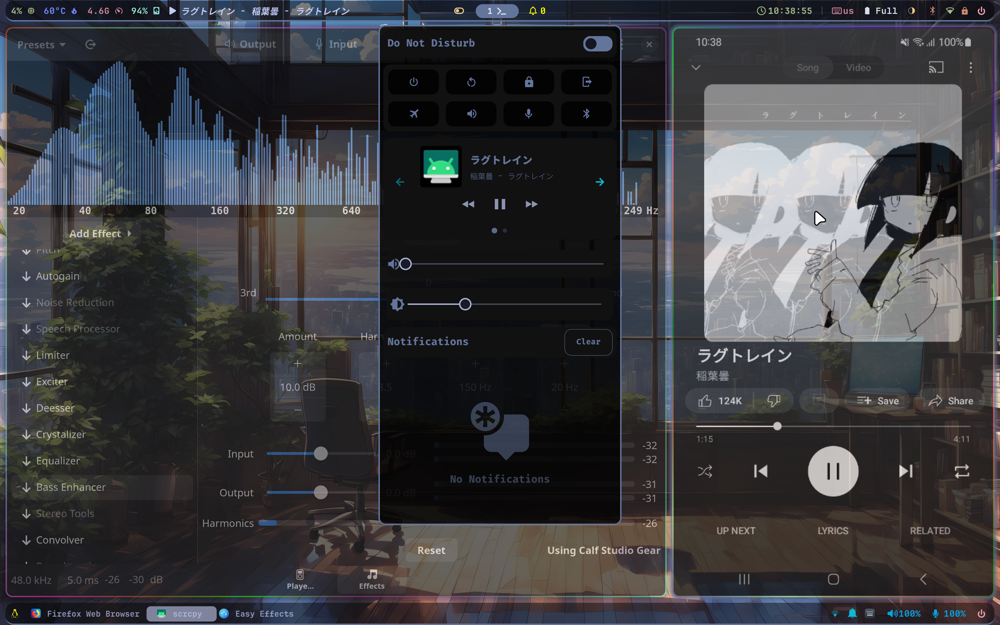

# scrcpyMediaController

Control your phone/emulator's media playback from your notification panel through MPRIS.<br>
This script works independently from scrcpy and does not require it to be installed or running for use.<br>
Take note that this "simple" script only works on GNU/Linux with MPRIS and only controls media playback. 
It does not forward audio. Use scrcpy or sndcpy to do that.<br>
**Credits:** Default album art icon (`icon.png`) from [scrcpy repository](https://github.com/Genymobile/scrcpy/blob/master/app/data/icon.png).<br>
Tested on Ubnutu Mantic 23.10 running Hyprland with `swaync`.


## Setup
Clone this repo, install Python3.12 and create a virtual environment
```bash
git clone https://github.com/AzlanCoding/scrcpyMediaController
sudo apt install python3.12 python3.12-venv python3.12-dev libgirepository1.0-dev
cd scrcpyMediaController
python3.12 -m venv virtualEnv
source ./virtualEnv/bin/activate
pip install mpris_server
exit
```
Once done can remove build packages:
```bash
sudo apt remove python3.12-dev libgirepository1.0-dev
sudo apt autoremove
```


## Running
Connect your device to your laptop via `adb` and run the command below.
```bash
./start_scrcpyMediaController.sh
```

Alternatively, you can manually activate the environment and run `main.py` using the following commands:
```bash
cd scrcpyMediaPlayer
source ./virtualEnv/bin/activate
python main.py
```


## Running in background
### Setting up
```bash
nohup ./start_scrcpyMediaController.sh 0 &
```
**DO NOT RUN `./start_scrcpyMediaController.sh & disown`.** Process will hang when `print()` or any standard output is called in the program.

### Killing
use `Btop++` or something to send signal 15 (SIGTERM) and kill the process with the program named `python`. [Don't use SIGKILL!!!](https://turnoff.us/geek/dont-sigkill/?ref=linuxhandbook.com)


## Customizing
In `main.py` you can change the 3 variables in lines 10-12
```python
artUrl = "file://"+os.path.join(os.path.dirname(__file__), 'icon.png')
playerName = "scrcpy"
updateFreq = 1
```
`artUrl` holds the location of the album art icon (player icon).<br>
`playerName` defines the name of the player.<br>
`updateFreq` specifies how frequent the player checks for updates in seconds.
