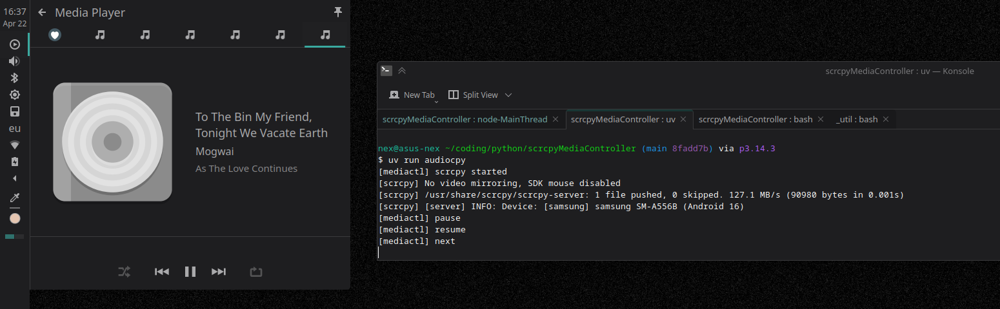

# audiocpy (scrcpyMediaController)


This program does two things:  
1. Shares audio from connected device to the pc, supressing it on the original device.  
2. Exposes Android media playback over MPRIS so desktop notification panels (swaync, dunst, waybar, etc.) can display and control it.  
  
I built it so that I can listen to a podcast from my phone while playing a game on my pc, and mix the audio on pc.  
An alternative sync is an A2DP sink but that introduces latency, lag & quality loss if you have multiple devices connected over bluetooth e.g. Xbox Controller, Wireless headphones (connected to PC) and Phone (streaming audio to PC). If you only connect your phone (e.g. have wired headphones and use mouse&keyboard for that game), you may not need this/scrcpy at all and A2DP might be sufficient.  
  
I have only tested this on linux. It will **not** work on Windows or MacOS, since they don't use MPRIS, but their own thing. On those OSes you can just do `scrcpy --no-window --no-video` and you get the audio part without the media controls.  
  
You need to install [scrcpy](https://scrcpy.org) ([github](https://github.com/genymobile/scrcpy), [repology](https://repology.org/project/scrcpy/versions)).  
Requires GNU/Linux with D-Bus, `adb` connected to a device, and `scrcpy` in PATH.  
  
audiocpy starts `scrcpy --no-window --no-video` alongside the controller and tears it down on exit; you can pass `--detach` to manage scrcpy yourself.  
Run `audiocpy --help` for all options.  
  
Album art is resolved offline via Android MediaStore only, with cached images stored in `~/.cache/scrcpyMediaController`.  
  
## System dependencies

**Fedora:**
```bash
sudo dnf install android-tools scrcpy python3-devel gobject-introspection-devel cairo-gobject-devel gcc pkg-config
```

**Debian/Ubuntu:**
```bash
sudo apt install adb scrcpy python3.12-dev libgirepository1.0-dev libcairo2-dev pkg-config gcc
```

The compiler and dev headers are only needed at install time to build `pydbus`/`PyGObject`. They can be removed afterwards.


## Install

With the system dependencies above in place:

```bash
uv tool install git+https://github.com/KraXen72/scrcpyMediaController
audiocpy
```


## Local development

```bash
git clone https://github.com/KraXen72/scrcpyMediaController
cd scrcpyMediaController
uv sync
uv run audiocpy
```

## Intentionally unsupported functionality:
- **Fetching album art for AntennaPod and Spotify** 
	- the only reliable found method is fetching through Android MediaStore (+ caching), which does not work for these apps
- **Shuffle/Loop controls** 
	- at one point they were implemented, but they didn't work. Removed for now, may be reintroduced later.

## Credits
Thanks to the [scrcpy repository](https://github.com/Genymobile/scrcpy/blob/master/app/data/icon.png) for the icon (`icon.png`).
Thanks to the [original project](https://github.com/AzlanCoding/scrcpyMediaController) for the initial code.
