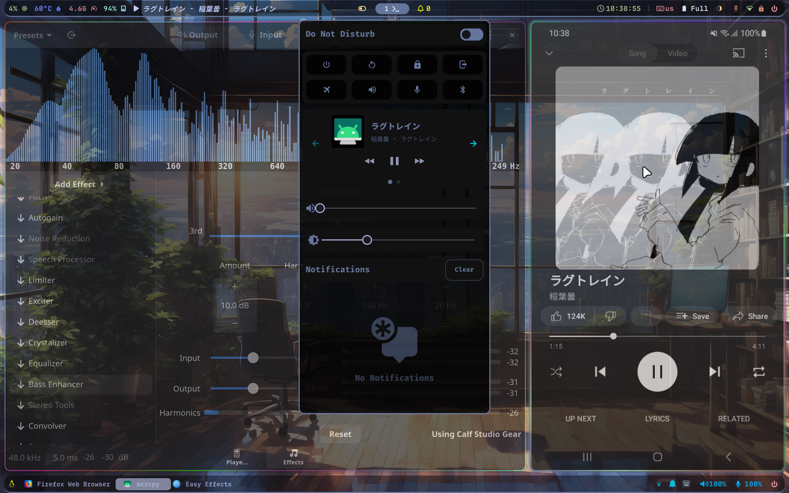

# scrcpyMediaController



Control your phone/emulator's media playback from your notification panel through MPRIS.

This script works independently from scrcpy and does not require it to be installed or running.
Note that this tool only works on GNU/Linux with MPRIS and only controls media playback — it does not forward audio. Use scrcpy or sndcpy for that.

**Credits:** Default album art icon (`icon.png`) from the [scrcpy repository](https://github.com/Genymobile/scrcpy/blob/master/app/data/icon.png).
Tested on Ubuntu Mantic 23.10 running Hyprland with `swaync`.


## Requirements

- GNU/Linux with D-Bus and MPRIS support
- `adb` (Android Debug Bridge) with a connected device
- Python 3.12+
- [uv](https://docs.astral.sh/uv/)


## Setup on Fedora

Install system dependencies (needed to build `PyGObject` / `pydbus`, which `mpris-server` relies on):

```bash
sudo dnf install android-tools python3-devel gobject-introspection-devel cairo-gobject-devel gcc pkg-config
```

Install `uv` (if you don't have it yet):

```bash
curl -LsSf https://astral.sh/uv/install.sh | sh
```

Clone the repo and let `uv` set up the environment:

```bash
git clone https://github.com/AzlanCoding/scrcpyMediaController
cd scrcpyMediaController
uv sync
```

That's it — `uv sync` creates a `.venv` and installs all Python dependencies automatically.

Once done, the build dependencies can be removed if you want to keep the system lean:

```bash
sudo dnf remove python3-devel gobject-introspection-devel cairo-gobject-devel gcc pkg-config
sudo dnf autoremove
```

> **Note:** `android-tools` (for `adb`) should be kept installed.


## Running

Connect your device via `adb`, then run:

```bash
./start_scrcpyMediaController.sh
```

This starts **both** `scrcpy --no-window --no-video` and the MPRIS media controller together. Output from each process is prefixed so you can tell them apart:

```
[scrcpy]   INFO: scrcpy 2.x
[scrcpy]   INFO: Connected to device
[mediactl] next
[mediactl] quitting...
```

Killing the script (Ctrl-C or SIGTERM) stops both processes cleanly.

### CLI options

Options are forwarded to the media controller:

```
Options:
  --art-url TEXT       URI to the album art / player icon.  [default: file://<repo>/icon.png]
  --player-name TEXT   MPRIS player name exposed on D-Bus.  [default: scrcpy]
  --update-freq FLOAT  How often (in seconds) to poll ADB for media state.  [default: 1.0]
  --help               Show this message and exit.
```

Example:

```bash
./start_scrcpyMediaController.sh --player-name myphone --update-freq 2
```

To run only the media controller without starting scrcpy:

```bash
uv run python main.py [OPTIONS]
```


## Running in the background

```bash
nohup ./start_scrcpyMediaController.sh &
```

Output from both processes is consumed by the prefixing pipe, so there is no hang-on-print issue.

### Stopping

Send SIGTERM to the script process — it will kill both children cleanly:

```bash
pkill -f start_scrcpyMediaController.sh
```

Or use `btop` / `htop` to send signal 15 (SIGTERM). [Don't use SIGKILL.](https://turnoff.us/geek/dont-sigkill/)


## Customizing

Pass options on the command line (see above). The three main knobs are:

| Option | Default | Description |
|---|---|---|
| `--art-url` | `file://<repo>/icon.png` | Album art shown in the media widget |
| `--player-name` | `scrcpy` | Name registered on D-Bus / shown in MPRIS clients |
| `--update-freq` | `1.0` | Polling interval in seconds |


## Setup on Ubuntu / Debian

```bash
sudo apt install android-tools-adb python3.12 python3.12-dev libgirepository1.0-dev libcairo2-dev pkg-config gcc
curl -LsSf https://astral.sh/uv/install.sh | sh
uv sync
```

Build dependencies can be removed afterwards:

```bash
sudo apt remove python3.12-dev libgirepository1.0-dev libcairo2-dev pkg-config gcc
sudo apt autoremove
```
